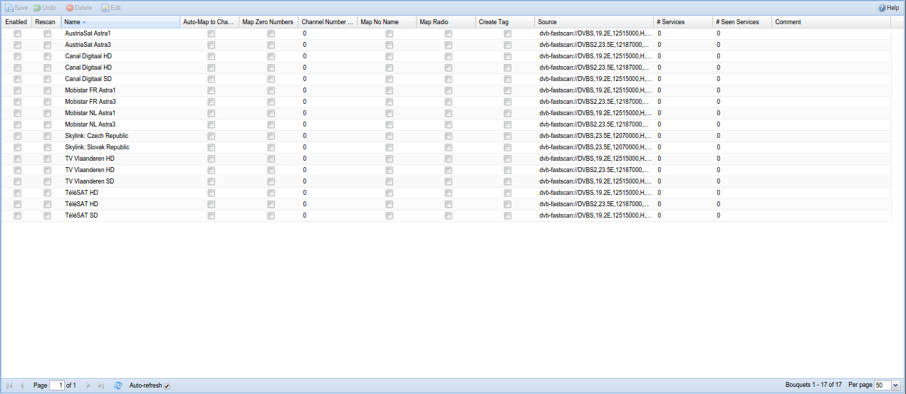
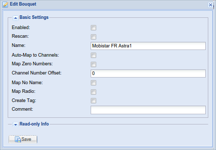

##Configuration - Channel/EPG - Bouquets

Bouquets are broadcaster-defined groupings and orders of channels.

To use bouquets, ensure to add and scan all available muxes using the
predefined muxes or manual configuration.

The bouquets are obtained automatically from the DVB source during the
mux scan period. Note that bouquets may use more muxes and only services
from scanned muxes are added. The mux with bouquets might require
another scan when all muxes are discovered (manually using the rescan
checkbox).

The fastscan bouquets are pre-defined in the configuration tree. These
bouquets must be manually enabled to let Tvheadend to subscribe and
listen to the specific MPEG-TS PIDs.

---

####Menu Bar/Buttons

The following functions are available:

Button            | Function
------------------|---------
**Save**          | Save any changes made to the bouquet configuration.
**Undo**          | Undo any changes made to the bouquetconfiguration since the last save.
**Delete**        | Delete an existing bouquet. 
**Edit**          | Edit an existing bouquet. This allows you to change any of the parameters you’d otherwise set when adding a new channel, e.g. enabled, map radio, etc.
**Help**          | Displays this help page. 

---

####Edit Dialog Example

Bouquets are automatically added, so you cannot define or add one manually. 
You may edit an existing one, however, with most fields also available in
the grid view:

---

####Grid Items

The main grid items have the following functions:

**Enabled**
: Text...

**Rescan**
: Text...

**Name**
: Text...

**Auto-Map to Channels**
: Text...

**Map Zero Numbers**
: Text...

**Channel Number Offset**
: Text...

**Map No Name**
: Text...

**Map Radio**
: Text...

**Create Tag**
: Text...

**Source**
: Text...

**# Services**
: Text...

**# Seen Services**
: Text...

**Comment**
: Text...
