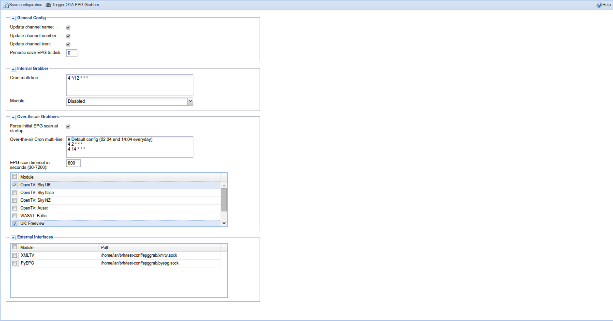

##Configuration - Channel/EPG - EPG Grabber

This tab is used to configure the Electronic Program Guide (EPG)
grabbing capabilities. Tvheadend supports a variety of different EPG
grabbing mechanisms. These fall into 3 broad categories, within which
there are a variety of specific grabber implementations.



####Menu Bar/Buttons

The following functions are available:

Button                       | Function
-----------------------------|---------
**Save Configuration**       | Save any changes made to the grabber configuration.
**Trigger OTA EPG Grabber**  | Force an immediate tune to the OTA EPG mux to request EPG updates.
**Help**                     | Displays this help page. 

---

####Grabber Types

* **Over-the-Air (OTA)**
: These grabbers receive EPG data directly from
  the DVB network. This is often the easiest way to get up and running
  and does provide timely updates should scheduling change. However,
  the information isn’t always as rich as some of the other grabbers.

* **Internal**
: These are grabbers which can be internally initiated from
  within Tvheadend using a very simple scheduler. These are typically
  Internet-based services. This can be a quick way to get richer EPG
  data where you don’t have decent OTA support.

* **External**
: These provide the option to run grabber scripts
  externally and to send data into Tvheadend via Unix domain sockets.
  It provides the ability to run more complex configurations using
  things like cronjob’s, script chains, etc.

####Grabber Modules

* **EIT**
: This is a DVB standards compatible EIT grabber. Typically it
  will retrieve now/next information, though on some networks there
  may be more extensive data published.

* **Freesat/view**
: This is an extended version of EIT that is used by
  the Free-to-air DVB providers in the UK. It includes additional
  information such as series links and episode identifiers.

* **OpenTV** 
: This is a proprietary OTA EPG grabber. It’s known to be
  used on the SKY networks, but others may use it. You need two
  configuration files to define settings for your particular network,
  if you don’t see yours listed please visit IRC \#hts for help.

* **XMLTV**
: This is an Internet-based suite of scripts that grab and manage television
  listings (see [xmltv.org](http://www.xmltv.org) for more information).
  To make use of the internal XMLTV grabber you typically require the
  xmltv-utils package to be installed. If you install new grabbers you
  will need to restart Tvheadend to pick these up as they’re loaded at
  startup. If you see no XMLTV grabbers listed then most probably
  XMLTV is not properly installed and in the PATH.

* **PyEPG**
: This is another Internet-based scraper. It currently only
  supports the Atlas UK system (for which you need a key), but it does
  provide a very rich EPG data set. For more information see
  <http://github.com/adamsutton/PyEPG>.

####Cron multi-line config text areas

The cron lines looks like:

```no-highlight
           # * * * * *  command to execute
           # ┬ ┬ ┬ ┬ ┬
           # │ │ │ │ │
           # │ │ │ │ │
           # │ │ │ │ └───── day of week (0 - 6 or Sunday - Saturday)
           # │ │ │ └────────── month (1 - 12)
           # │ │ └─────────────── day of month (1 - 31)
           # │ └──────────────────── hour (0 - 23)
           # └───────────────────────── min (0 - 59)
```

With the following cron special characters...

* **Asterisk (`*`)**
: The asterisk indicates that the cron expression matches for all
  values of the field. E.g., using an asterisk in the 4th field
  (month) indicates every month.
    
* **Slash (`/`)**
: Slashes describe increments of ranges. For example 3-59/15 in the
  1st field (minutes) indicate the third minute of the hour and every
  15 minutes thereafter. The form “*…” is equivalent to the form
  “first-last…”, that is, an increment over the largest possible
  range of the field.
    
* **Comma (`,`)**
  Commas are used to separate items of a list. For example, using
  “MON,WED,FRI” in the 5th field (day of week) means Mondays,
  Wednesdays and Fridays.
    
* **Hyphen (`-`)**
: Hyphens define ranges. For example, 2000-2010 indicates every year
  between 2000 and 2010 AD, inclusive.
    
* **Number-sign (`#`)**
: Number-sign defines a start of a comment. The rest of line is
  ignored behind this character.

---

####Configuration Options

#### General Config

**Update channel name**
: Automatically update channel names using information provided by the
  enabled EPG providers.

**Update channel number**
: Automatically update channel numbers using information provided by the
  enabled EPG providers.

**Update channel icon**
: Automatically update channel icons using information provided by the
  enabled EPG providers.

**Periodic save EPG to disk Interval**
: Writes the current in-memory EPG database to disk every x Hours (user
  defined), so should a crash/unexpected shutdown occur EPG data is saved
  periodically to the database (Re-read on next startup). Set to 0 to
  disable.

#### Internal Grabber

**Module**
: Select which internal grabber to use.

**Cron multi-line**
: Multiple lines of the cron time specification.

#### Over-the-air Grabbers

**Force initial EPG scan at startup**
: … no comment

**Cron multi-line**
: Multiple lines of the cron time specification.

**EPG scan timeout in seconds**
: The multiplex (mux) is tuned for this amount of time at maximum. If EPG
  data are completed before this limit, the mux is released sooner.

**Checkbox list**
: Checkbox list to enable/disable available modules. By default all
  grabbers should be enabled.

#### External interfaces

Checkbox list to enable/disable available modules. The path field
contains the absolute path of the unix domain socket into which EPG data
can be sent.

To send data to the socket use the command `netcat -u SOCKET_PATH`.

Note: for some systems the netcat flags can vary so please consult the
man page.

####Notes

To apply any changes please use the [Save configuration button]

XMLTV/PyEPG - if you are using the internal versions of these modules
then you must first configure them externally as Tvheadend provides no
support for this. Nor does it provide the ability to pass command line
options (for this use the external interface).
