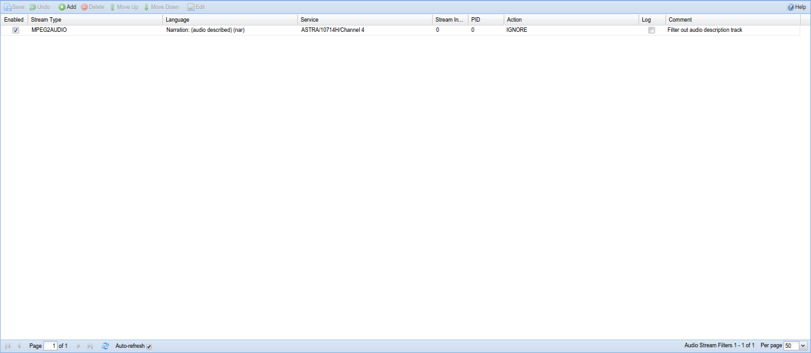
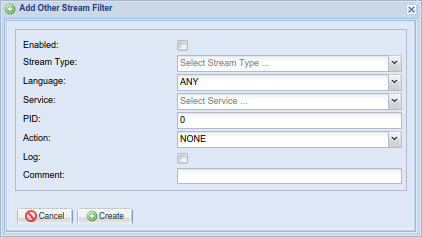

##Configuration - Stream - Elementary Stream Filters

Elementary Stream Filters

This section applies to the filters for <strong>Video</strong>,
<strong>Audio</strong>, <strong>Teletext</strong>, <strong>Subtitle</strong>,
<strong>CA</strong> and <strong>Other</strong>.

  

This table defines rules to filter and order the elementary streams
(PIDs) like video or audio from the input feed.
The execution order of commands is granted. It means that first rule is
executed for all available streams then second and so on.

If any elementary stream is not marked as ignored or exclusive, it is
used. If you like to ignore unknown elementary streams, add a rule to
the end of grid with the any (not defined) comparisons and with the
action ignore.

The rules for different elementary stream groups (video, audio,
teletext, subtitle, CA, other) are executed separately (as visually
edited).

For the visual verification of the filtering, there is a service info
dialog in the Configuration / DVB Inputs / Services window . This dialog
shows the received PIDs and filtered PIDs in one window.

---

####Menu Bar/Buttons

The following functions are available:

Button          | Function
----------------|---------
**Save**        | Save any changes made to the filters.
**Undo**        | Undo any changes made to the filters since the last save.
**Add**         | Add a new filter.
**Delete**      | Delete an existing filter. 
**Move Up**     | Move the filter up in the list. 
**Move Down**   | Move the filter down in the list.
**Edit**        | Edit an existing filter. This allows you to change any of the parameters you’d otherwise set when adding a new channel, e.g. language, PID, action, etc.
**Help**        | Displays this help page. 

---

####Add/Edit Dialog Example

A common set of fields is used for the _Add_ or _Edit_ functions, most
of which can also be seen in the grid view:

---

####Grid Items

The main grid items have the following functions:

**Class**:
: Text...

**Index**
: Text...

**Enabled**
: If selected, the rule will be enabled.

**Stream Type**
: Select the elementary stream type to compare. Empty field means any.

**Language**
: Select the language to compare. Empty field means any. *Not applicable to CA filters*.

**Service**
: The service to compare. Empty field means any.

**CA Identification**
: The CAID to compare. Empty field means any. *Applicable only to CA filters*.

**CA Provider**
: The CA provider to compare. Empty field means any. *Applicable only to CA filters*.

**Stream Index**
: The logical stream index to compare. Note that this index is computed
  using all filters.

>  Example: If filter is set to AC3 audio type and the
  language to ‘eng’ and there are two AC3 ‘eng’ streams in the service,
  the first stream could be identified using number 1 and the second using
  number 2.

**PID**
: Program identification (PID) number to compare. Zero means any. This
  comparison is processed only when service comparison is active and for
  the Conditional Access filter.

**Action**
: The rule action defines the operation when all comparisons succeeds.

* **NONE**
: No action, may be used for the logging and a comparison verification.

* **USE**
: Use this elementary stream.

* **ONE\_TIME**
: Use this elementary stream only one time per service type (like video,
  audio, subtitles) and language. The first sucessfully compared rule
  wins. For example, when one AC3 elementary stream is marked to be used
  with ‘eng’ language and another rule with the ONE\_TIME action was
  matched, the new AC3 elementary stream will not be added if the language
  for new AC3 elementary stream is ‘eng’. Note that the second rule might
  not have the language filter (column) set.
  For the CA filter, this rule means that the new CA elementary stream is
  added only if another CA is not already used.

* **EXCLUSIVE**
: Use only this elementary stream. No other elementary streams will be
  used.

* **EMPTY**
: Add this elementary stream only when no elementary streams are used from
  previous rules.

* **IGNORE**
: Ignore this elementary stream. This stream is not used. Another
  successfully compared rule with different action may override it.

**Log**
: Write a short message to log identifying the matched parameters. It is
useful for debugging your setup or structure of incoming streams.

**Comment**
: Free-format text comment. Not used otherwise.
