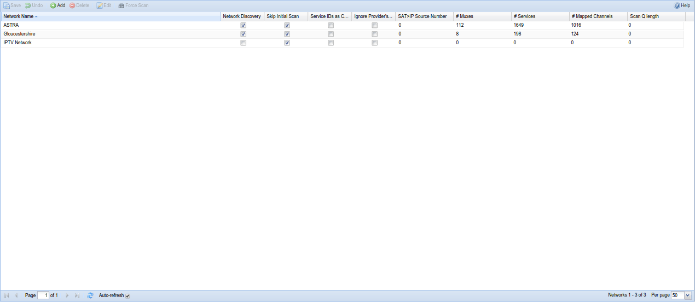
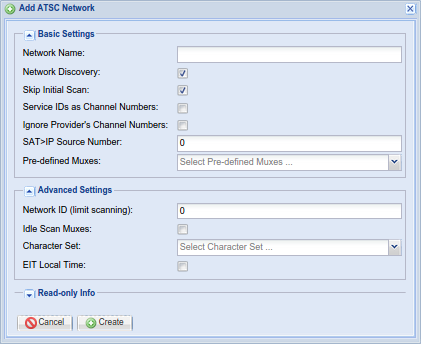
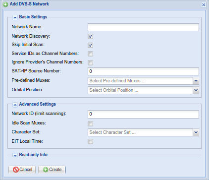
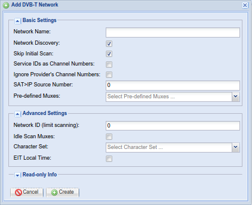
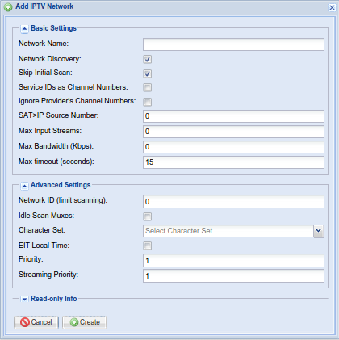

##Configuration - DVB Inputs - Networks

A network is the type of carrier for your television signals. Tvheadend
supports several different types of network, notably:

* **DVB-C** : Cable TV, delivered via a cable to your house

* **DVB-S** : Satellite (includes S2), so any signal coming in via a dish

* **DVB-T** : Terrestrial, so over-the-air broadcasts received through a
traditional television aerial

* **ATSC** : Over-the-air terrestrial, common in north and central America
and parts of south Asia

* **IPTV** : IP, so over the Internet

---

####Add/Edit Dialog Example

A common set of fields is used for the _Add_ or _Edit_ functions, most
of which can also be seen in the grid view:

---

####Menu Bar/Buttons

The following functions are available:

Button         | Function
---------------|---------
**Save**       | Save any changes made to the network configuration.
**Undo**       | Undo any changes made to the network configuration since the last save.
**Add**        | Add a new network. You can choose from any of the types described above.
**Delete**     | Delete an existing network. This will also remove any association with an adapter.
**Edit**       | Edit an existing network. This allows you to change any of the parameters you’d otherwise set when adding a new network, e.g. network discovery, idle scan, etc. - similar to using the check boxes to enable/disable functions.
**Force Scan** | Force a new scan (i.e. scan all muxes for services) for the selected networks.
**Help**       | Displays this help page. 

---

####Grid Items

The main grid items have the following functions:

**Network Name**
: The name of the network. This can be set automatically or you can give
  it a name that means something to you (e.g. if you have multiple OTA
  networks).

**Network ID (limit scanning)**
: If you experience problems caused by overlaps between multiple network
  providers this option can be used to filter which network ID is received
  by a given adapter.
  
**Network Discovery**
: Whether automatic discovery is enabled for this network, i.e. whether
  Tvheadend looks for muxes or simply stays with the list of muxes as
  defined initially.

**Skip initial Scan**
: Don’t scan all muxes in this network at Tvheadend start. The initial
  scan procedure is not a blind scan. Only known muxes registered to this
  network are scanned. If Network Discovery is enabled and new muxes are
  discovered using DVB descriptors, these muxes will be scanned too.

**Idle Scan Muxes**
: When nothing else happens Tvheadend will continuously rotate among all
  muxes and tune to them to verify that they are still working when the
  inputs are not used for streaming. If your adapter have problems with
  lots of (endless) tuning, try to disable this. Note that this option
  should be OFF for the normal operation. This type of mux probing is not
  required and it may cause issues for SAT\>IP (limited number of PID
  filters).

**Ignore Provider’s Channel Numbers**
: Some providers will try to set a channel number so that every receiver
  is consistent - “tune to Channel x on 150”. This option allows you to
  ignore this and let tvhheadend allocate a channel number itself.

**SAT\>IP Source Number**
: This field is matched through the “src” parameter asked from the SAT\>IP
  client. Usually (and by default) this value is 1. For satellite tuners,
  this value determines the satellite source (dish). By specification
  position 1 = DiseqC AA, 2 = DiseqC AB, 3 = DiseqC BA, 4 = DiseqC BB, but
  any numbers may be used - depends on the SAT>IP client. Note that if
  you use same number for multiple networks, the first matched network
  containing the mux with requested parameters will win (also for unknown
  mux). If this field is set to zero, the network cannot be used by the
  SAT>IP server.

**Character Set**
: The character encoding for this network (e.g. UTF-8).

**EIT Local Time**
: EPG (EIT) events uses local time instead of UTC.

**# Muxes**
: The number of muxes defined for/discovered on this network.

**# Services**
: The number of services (across all muxes) defined for/discovered on this network.

**# Mapped Channels**
: The number of channels (across all services) mapped for this network.

**Scan Q Length**
: The number of muxes remaining to be scanned on this network.

####IPTV-Specific Configuration Items (Add/Edit Dialogs Only)

**Max Input Streams**
: Maximum simultaneous streams that can be played.

**Max Bandwidth**
: Maximum bandwidth allowed for streams.

**Max timeout**
: Maximum timeout trying to play stream.

**Priority**
: The network priority value (higher value = higher priority to use
  muxes/services from this network).

**Streaming Priority**
: The network priority value for streamed channels through HTTP or
  HTSP (higher value = higher priority to use muxes/services from this
  network). If not set, the standard network priority value is used.
