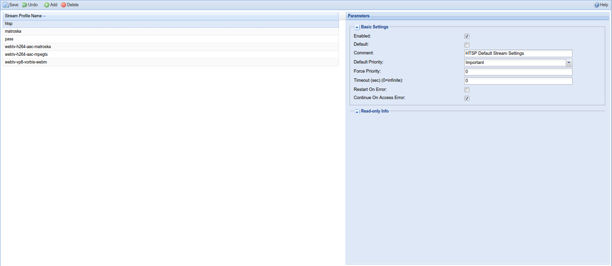
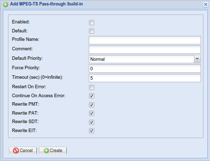
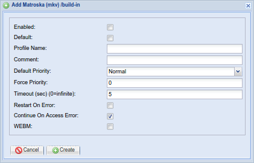
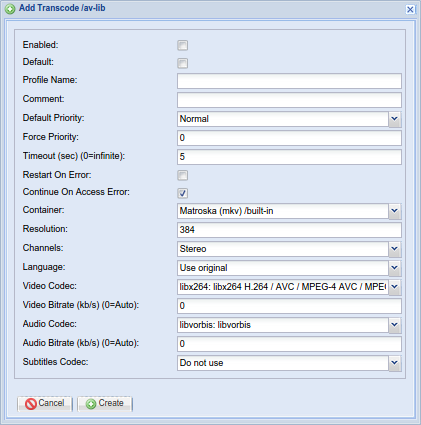

##Configuration - Stream - Stream Profiles

Stream Profiles are the settings for output formats. These are used for Live TV
streaming and recordings. The profiles are assigned through the Access Entries,
DVR Profiles or as parameter for HTTP Streaming.

---

###Menu Bar/Buttons

The following functions are available:

Button     | Function
-----------|---------
**Save**   | Save any changes made to the stream profile configuration.
**Undo**   | Undo any changes made to the stream profile configuration since the last save.
**Add**    | Add a new stream profile.
**Delete** | Delete an existing stream profile.
**Help**   | Display this help page.

---

####Add/Edit Dialog Example

A common set of fields is used for the _Add_ or _Edit_ functions, most
of which can also be seen in the grid view:

---

###Stream Profile Types

**MPEG-TS Pass-through /build-in**
: Pass through of MPEG-TS packets.

**Matroska (mkv) /build-in**
: Matroska/WebM muxer (built-in) to output in Matroska format.

**HTSP Stream Profile**
: Stream Settings for HTSP.

**MPEG-TS /av-lib**
: MPEG-TS stream muxer (libav) to output in MPEG-TS format
  (only available with libav/ffmpeg).

**Matroska /av-lib**
: Matroska/WebM muxer (libav) to output in Matroska format
  (only available with libav/ffmpeg).

**Transcode /av-lib**
: Transcode video/audio/subtitles with various encoders and output in various
  formats (only available with libav/ffmpeg).

###Common Settings

**Enabled**
: Profile is enabled.

**Default**
: Profile is the default profile.

**Default Priority**
: The priority of the profile, if no specific priority was requested. This allows
  to give certain users a higher priority by assigning a streaming profile with
  a higher priority.

**Force Priority**
: Don't allow the Default Priority to be overridden.

**Timeout**
: Timeout for streaming to start.

**Restart On Error**
: Restart streaming on error. This is useful for DVR, so a recording isn't aborted
  if an error occurs.

**Continue On Access Error**
: Don't abort streaming, when an encrypted stream can't be decrypted by a
  CA client, that normally should be able to decrypt the stream.

**Preferred Service Video Type** [*v4.2*]
: The selected video type should be preferred, when multiple services are
  available for a channel.

###MPEG-TS Pass-through Settings

**Rewrite PMT/PAT/SDT/EIT**
: Rewrite PMT/PAT/SDT/EIT packets to only include information about the currently
  streamed service.

###Matroska Settings

**WEBM**
: Use WebM format (WebM is a restricted subset of the Matroska format)

###Transcode Settings

**Container**
: Container to use for transcoded streams.

**Resolution**
: Vertical resolution (height) of the output video stream. Horizontal resolution
  is adjusted automatically to preserve aspect ratio. When set to 0, the input
  resolution is used.

**Channels**
: Channel layout for audio streams.

**Language**
: Currently unused.

**Video Codec**
: Video encoder codec.

* **Do not use**
: Don't output a video stream.

* **Copy codec type**
: Pass through video stream without transcoding.

* **mpeg2video/libvpx/libx264/...**
: Transcode video to the selected codec.

**Video Bitrate**
: Video quality/bitrate of the transcoded video stream.

* **0: Automatic Setting (target quality)**
: The automatic setting is dependent on the used codec. The respective
  values used are 5 for MPEG2 and 15 for H.264 and VP8, which are pretty high
  and therefore might result in an even higher bitrate than the input video.

* **1-63: Target Quality**
: Use the given value to achieve average quality. A lower value results
  in better quality. The resulting bitrate is dependent on the complexity
  of the video stream.

* **>63: Target Bitrate**
: Use the given value to achieve average bitrate. The resulting quality
  is dependent on the complexity of the video stream.

**Audio Codec**
: Codec for audio streams.

* **Do not use**
: Don't output an audio stream.

* **Copy codec type**
: Pass through audio streams without transcoding.

* **aac/mp2/libvorbis/...**
: Transcode audio to the selected codec. (Note: if "vorbis" and "libvorbis" are
  available, "libvorbis" should be prefered when transcoding to Vorbis format)

**Audio Bitrate**
: Audio bitrate of the transcoded audio streams.

**Subtitles Codec**
: Codec for subtitles.

* **Do not use**
: Don't output subtitles.

* **Copy codec type**
: Pass through subtitles without transcoding.
