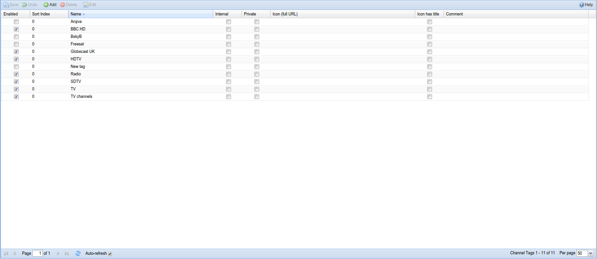

##Configuration - Channel/EPG - Channel Tags

This tab is used to configure channel tags. Tags are used to define a
set of channels - to group them, to aid searches, and similar. Tags are not
required by Tvheadend itself, but are useful in media applications such
as Kodi and are a requirement for using Tvheadend with Movian.

---

####Menu Bar/Buttons

The following functions are available:

Button            | Function
------------------|---------
**Save**          | Save any changes made to the tag configuration.
**Undo**          | Undo any changes made to the tag configuration since the last save.
**Add**           | Add a new tag.
**Delete**        | Delete an existing tag. 
**Edit**          | Edit an existing tag. This allows you to change any of the parameters you’d otherwise set when adding a new channel, e.g. internal/private status, icon, etc.
**Help**          | Displays this help page. 

---

####Grid Items

The main grid items have the following functions:

**Enabled**
: Make the tag available in the rest of the system. If the tag is not
  enabled it is only presented in this grid for the administrator.

**Name**
: Name of the tag. Changing the tag name does not interfere with any
  automatic recordings, groups, etc.

**Internal**
: Tags are exported via HTSP/HTTP and used there for grouping of TV
  channels. If you do not wish to export a tag you can flag it as internal
  only.

**Private**
: Tags are exported via HTSP/HTTP and used there for grouping of TV
  channels. If you do not wish to export a tag to other users you can flag
  it as private only. Only users with this tag configured in the access
  configuration (or users with not set tags) can use it.

**Icon**
: Full path to an icon used to depict the tag. This can be a TV network
  logotype, etc.

**Icon has title**
: If set, presentation of the tag icon will not superimpose the tag name
  on top of the icon.

**Comment**
: Allows the administrator to set a comment only visible in this editor.
  It does not serve any active purpose.
