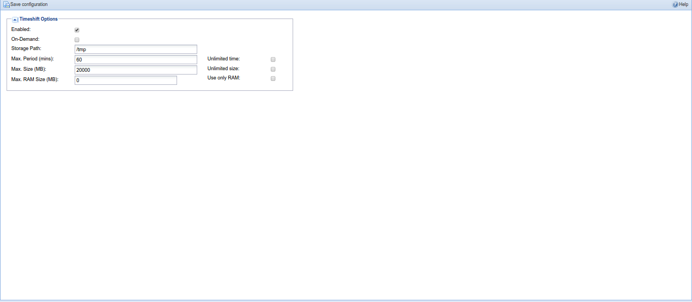

##Configuration - Recording - Timeshift

This tab is used to configure timeshift properties.

---

####Menu Bar/Buttons

The following functions are available:

Button                   | Function
-------------------------|---------
**Save Configuration**   | Save any changes made to the timeshift configuration
**Help**                 | Display this help page.

---

####Configuration options

**Enabled**
: Turn on and off timeshift.

**On-Demand**
: Turn this on to start timeshift buffer on pause. In this mode you cannot
  rewind the buffer (it always begins on the currently playing frame).
  Without this option there will be a permanent, circular, buffer up to
  the limits defined below.

**Storage Path**
: Where the timeshift data will be stored. If nothing is specified this
  will default to CONF\_DIR/timeshift/buffer

**Max. Period (mins)**
: Specify the maximum time period that will be buffered for any given
  (client) subscription.

**Unlimited**
: If checked, this allows the timeshift buffer to grow unbounded until
  your storage media runs out of space.

Danger

Unless you have adequate storage, or monitor use, enabling this option
could cause your system to slow down or crash completely!

**Max. Size (MegaBytes)**
: Specifies the maximum combined size of all timeshift buffers. If you
  specify an unlimited period its highly recommended you specifying a
  value here.

**Max. RAM Size (MegaBytes)**
: Specifies the maximum RAM (system memory) size for timeshift buffers.
  When free RAM buffers are available, they are used instead storage to
  save the timeshift data.

**Unlimited**
: If checked, this allows the combined size of all timeshift buffers to
  potentially grow unbounded until your storage media runs out of space.

Danger

Unless you have adequate storage, or monitor use, enabling this option
could cause your system to slow down or crash completely!

Changes to any of these settings must be confirmed by pressing the ‘Save
configuration’ button before taking effect. 

Note

These settings represent server side maximums, however the clients can
request smaller buffers or even not to create a buffer at all (for example 
should they not support timeshifting).

