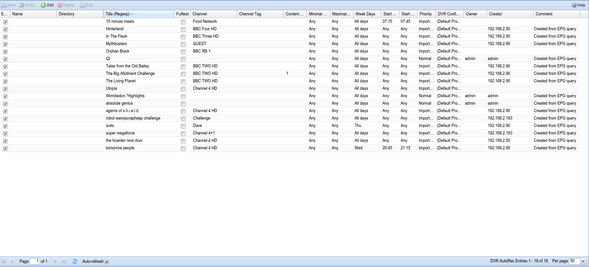

##Digital Video Recorder - Autorec

This tab is used to create and maintain Digital Video Recorder rules.
These can be EPG-driven (such as those created from the initial EPG tab)
through the DVR AutoRec Entries tab , or can be timer-based through the
Time Schedules tab.

This tab controls EPG-driven recording rules.

---

####Menu Bar/Buttons

The following functions are available:

Button       | Function
-------------|----------
**Save**     | Save any changes made to the recording rule list.
**Undo**     | Undo any changes made to the recording rules list since the last save (changes are marked with a small red triangle).
**Add**      | Add and configure a recording rule - define the channel, schedule, DVR configuration, priority, etc.
**Delete**   | Delete an existing recording rule.
**Edit**     | Manually edit an existing recording rule. This uses the same fields as **Add**, but they’re pre-populated with their current values.
**Help**     | Display this help page.

---

####Columns

The columns have the following functions:

**Enabled**
: Check or clear this box to enable or disable this rule.

**Name**
: The name you’ve given to the rule, e.g. ‘Stuff involving Jeremy
Clarkson’.

**Directory**
: When specified, this setting overrides the subdirectory rules (except
the base directory) specified by the DVR configuration and puts all
recordings done by this entry into the specified subdirectory. 

> Useful for e.g. recording multiple different news broadcasts into one common
> subdirectory called “News”. The backslash and other special characters
> are escaped, so it is possible to create only one sublevel
> subdirectories (the base path for the target directory is always taken
> from the DVR configuration).

**Title (Regexp)**
: The title of the programme to look for. Note that this accepts
case-insensitive regular expressions, so you can use pattern matching as
Tvheadend scans the EPG for programmes to record.

**Fulltext**
: When the fulltext is checked, the title pattern is matched against
title, subtitle, summary and description.

**Channel**
: The channel on which this rule applies, i.e. the channel you’re aiming
to record.

**Channel Tag**
: A channel tag (e.g. a group of channels) on which this rule applies.

**Content Type**
: The content type (*Movie/Drama*, *Sports*, etc.) to be used to filter
matching events/programmes.

**Minimal Duration**
: The minimal duration of a matching event - in other words, only match
programmes that are no shorter than this duration.

**Maximal Duration**
: The maximal duration of a matching event - in other words, only match
programmes that are no longer than this duration.

**Week Days**
: On which specific days of the week to find matching programmes.

**Start After**
: An event which starts between this “start after” and “start before” will
be matched (including boundary values).

**Start Before**
: An event which starts between this “start after” and “start before” will
be matched (including boundary values).

**Priority**
: The priority of any recordings set because of this rule: in descending 
priority, values are *important*, *high*, *normal*, *low*, and *unimportant*.
Higher-priority events will take precedence and cancel lower-priority events.

**DVR Configuration**
: The DVR configuration (e.g. extra start/stop time, post-processing
rules) to be used for any recordings set because of this rule.

**Creator**
: The creator of the rule. Automatically set.

**Comment**
: A free-text comment. Not used otherwise.

