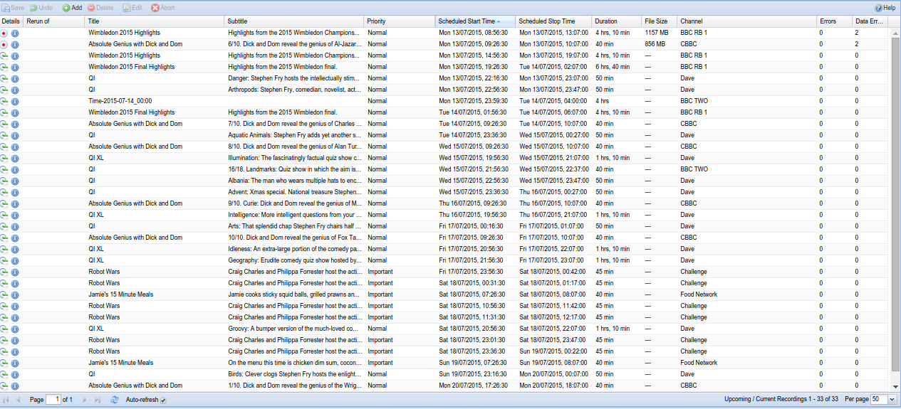
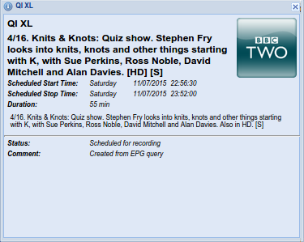

##Digital Video Recorder - Upcoming/Current Recordings

This tab show your all upcoming/current recordings.

---

####Menu Bar/Buttons

The following functions are available:

Button     | Function
-----------|----------
**Save**   | Saves any changes made to the recording list.
**Undo**   | Undo any changes made since the last save.
**Add**    | Add and configure a recording event by hand as opposed to choosing something from the EPG. This is useful if you wish to record something that isn’t yet in the EPG, or record at a particular time that perhaps spans several EPG events.
**Delete** | Delete the selected recording event. You will be prompted for confirmation.
**Abort**  | Abort an already-underway recording. Note that this does not remove the (partial) recording file from disk.
**Edit**   | Manually edit an already-scheduled recording event. This uses the same fields as **Add**, but they’re obviously pre-populated with their current values.
**Help**   | Display this help page.

---

####Grid Items

The main grid items have the following functions:

**Details**
: Shows the status of the recording event:

Icon                                       | Description
-------------------------------------------|-------------
             | the programme is scheduled (upcoming)
           | the programme is active and underway (current)
 | click to display detailed information about the selected recording (upcoming or current)

The detailed information dialog is as follows:

**Rerun Of**
: Text...

**Title**
: The title (name) of the recording. While this is copied from the EPG
when you create a recording, it’s not used to match the event itself and
is thus used here as the name of the event (see also: adding an event
manually with the **Add** button).

**Subtitle**
: Text...

**Episode**
: The episode number of the recording (whether this is available depends
on your broadcaster and/or EPG data source).

**Priority**
: The priority of the recording: Not set, Important, High, Normal, Low,
Unimportant. If there is a clash, more important recordings will take priority over
less important ones.

**Scheduled Start Time**
:The date and time when the scheduled recording will start. Note that
this includes any extra time defined in the recording profile (e.g.
“start two minutes earlier than the EPG start time”).

**Scheduled Stop Time**
: The date and time when the scheduled recording will stop. Note that this
includes any extra time defined in the recording profile (e.g. “finish
recording five minutes after the EPG stop time”).

**Duration**
: The total duration of the scheduled recording, including any extra time
before or after.

**File Size**
: Text...

**Channel**
: The channel to be recorded.

**Owner**
: Text...

**Creator**
: The user who created the recording or the auto-recording source and IP
address if scheduled by a matching rule.

**DVR Configuration**
: The DVR configuration to be used for this recording.

**Schedule Status**
: The status of the recording (scheduled or recording).

**Errors**
: Text...

**Data Errors**
: Text...

**Comment**
: Text...
