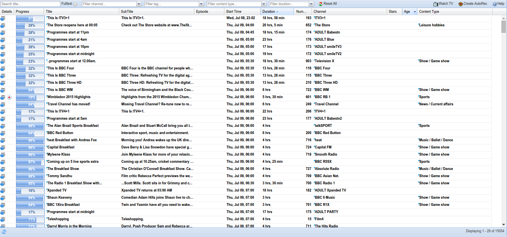
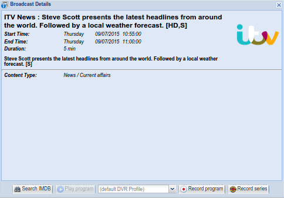
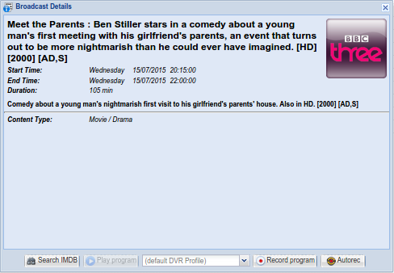
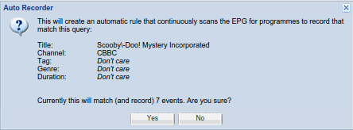

##Electronic Program Guide

Tvheadend has a built-in Electronic Program Guide. The EPG is an
in-memory database populated with all the information about events
received from the DVB networks over-the-air or from external grabbers
such as XMLTV.

The EPG tab displays a filterable grid containing all events, sorted
based on start time.

---

###Menu Bar/Buttons

The following functions are available:

####Filtering (or searching)

In the EPG top tool bar you can access five input fields. These are used
to filter/search for events. The form uses implicit AND between the
input fields. This means that all filters must match for an event to be
displayed.

Filter                     | Function
---------------------------| --------
**Search title...**        | Only display events that match the given title.  The filter uses case-insensitive regular expressions. If you don’t know what a regular expression is, this simply means that you can type just parts of the title and filter on that - there’s no need for full, exact matching. If the fulltext checkbox is checked, the title text is matched against title, subtitle, summary and description.
**Filter channel...**      | Only display events from the selected channel.  Channels in the drop down are ordered by name and can be filtered (by name) by typing in the box.
**Filter tag...**          | Only display events from channels which are included in the selected tag.  Tags are used for grouping channels together - such as ‘Radio’ or ‘HDTV’ - and are configured by the administrator. You can start typing a tag name to filter the list.
**Filter content type...** | Only display events that match the given content type tag.  Most DVB networks classify their events into content groups. This field allows you to filter based on content type (e.g. “Sports” or “Game Show”). Supported tags are determined by your broadcaster. Again, simply start typing to filter the entries if you have a long list to choose from.
**Filter duration...**     | Only display events that fall between the given minimum and maximum durations.  This allows you to filter for or against, say, a daily broadcast and a weekly omnibus edition of a programme, or only look for short news bulletins and not the 24-hour rolling broadcasts.

*Title*, *Channel*, *Tag* and *Content Type* are dependent on your configuration and on what your 
broadcaster sends. Options for the *Duration* are as follows:

Filter Range           | Example Purpose
-----------------------|----------------
00:00:01 to 00:15:00   | Very short news bulletins, children's programmes, etc.
00:15:01 to 00:30:00   | Short programmes, e.g. daily soap operas
00:30:01 to 01:30:00   | Medium-length programmes, e.g. documentaries
01:30:01 to 03:00:00   | Longer programmes, e.g. films
03:00:00 to no maximum | Very long programmes, e.g. major sporting events

So, if you only want to see Movies from your available HD channels, you
would select ‘HDTV’ in the *[Filter tag…]* field, and select ‘Movie /
Drama’ in the *[Filter content type…]* field. If you wish, you could
then further limit the search to programmes of between 90 minutes and 3
hours by selecting ‘01:30:01 to 03:00:00’ in the *[Filter duration…]*
field.

Note that you don’t have to press a ‘Search’ button: the grid
immediately updates itself as you change the filters.

You can clear an individual filter by simply deleting its contents, or
by selecting *‘(Clear filter)’* as appropriate on all except the title
filter. If you want to clear all filters, just press the *[Reset All]*
button.

####Buttons

The following buttons are also available:

Button              | Function
--------------------|----------
**Reset All**       | Clears all search filters.
**Watch TV**        | Launches Live TV via HTML5 video (see below).
**Create Autorec**  | Creates an auto-recording rule based on the current filter criteria (see below).
**Help**            | Display this help page.

---

###Grid Items

The main grid items have the following functions:

**Details**
: Displays the current status of a recording event for this programme if 
  one applies: 

Icon                                                   | Description
-------------------------------------------------------|-------------
                         | the programme is scheduled for recording
                       | the programme is currently recording
 | click to call up more detailed information about an event

**Progress**
: A bar graph display of how far through a programme we currently are.

**Title**
: The title of the programme. *You can automatically set a filter to the
  value of this field by clicking on it (e.g. click on 'Daily News' will
  automatically filter the whole grid to only show programmes with the same
  name).*

**SubTitle**
: The subtitle of the programme, if gien by your EPG provider. Note that some
  (notably, UK) providers use this for a programme synopsis instead of a true
  subtitle.

**Episode**
: Episode number, if given by your EPG provider.

**Start Time**
: The scheduled start time of the programme.

**End Time**
: The scheduled end time of the programme.

**Duration**
: The scheduled duration (i.e. start time to end time) of the programme. 

**Number**
: The channel number of the broadcasting channel, if defined.

**Channel**
: The name of the broadcasting channel. *You can automatically set a filter to the
  value of this field by clicking on it (e.g. click on 'Channel 4 HD' will
  automatically filter the whole grid to only show programmes from that channel).*

**Stars**
: Rating (in stars) of the programme.

**Age**
: Age rating of the programme.

**Content Type**
: Any content/genre information as provided by the EPG provider. *You can
  automatically set a filter to the value of this field by clicking on it
  (e.g. click on 'Movie/Drama' will automatically filter the whole grid
  to only show programmes of the same type).*

---

###Event details and recording

If you click on a single event, a popup will display detailed
information about the event. It also allows you to schedule the event
for recording by clicking on the *[Record program]* button.

For EPG providers that supply series link information there will also be
a *[Record series]* button that will record all entries in the series.

For events without any series link information, an *[Autorec]* button
will be provided to create a pseudo-series link using the autorec
feature.

If you schedule any kind of recording from this point, you can choose a
specific DVR profile that will apply to the recording or autorec rule.
This will normally show as *(default)*, but you can define different
profiles in the **Configuration -\> Recording -\> Digital Video
Recorder** tab. This allows you to set, for example, more post-
broadcast padding for a channel that always runs late, or perhaps define
a different post-processing command to strip adverts out on a commercial
channel.

You will also see a *[Search IMDB]* button to look for the programme by name
on imdb.com, and a *[Play program]* button to watch a programme that’s already
in progress. This second button downloads a playlist file (XSPF or M3U
depending on your startup options); if your system is configured for it,
this will automatically launch an appropriate player, otherwise you will
need to manually open the playlist to start watching (normally a
double-click on the downloaded file).

To close the popup, just click on the [X] window button. The popup isn’t
modal, so you don’t have to close it before doing something else, and
you can open as many detailed information popups as you want.

---

###Autorecordings

Should you wish to record all events matching a specific query (to
record your favourite show every week, for example) you can press the
*[Create AutoRec]* button in the top toolbar.

A popup with details about the to-be-created autorecording rule needs to
be confirmed before the rule takes effect.

You can change or delete the autorec rules in the **Digital Video
Recorder** tab. Use that editor if you temporarily want to disable an
autorecording or make adjustments to the channel, tag, or similar.

---

###Watch TV

If you want to watch live TV in the web UI, the *[Watch TV]* button will
pop up a HTML5 video player, where you can select the channel to watch and a
stream profile to use. A transcoding stream profile is required to transcode 
the stream to a format that is supported by your browser, as browsers only
support certain formats and codecs.

####Supported formats (containers)

Browser | MPEG-TS | MPEG-PS | Matroska | WebM
------- | :-----: | :-----: | :------: | :--:
Google Chrome |  |  |  | 
Mozilla Firefox |  |  |  | 

####Supported video codecs

Browser | MPEG2 Video | H.264 | VP8
------- | :---------: | :---: | :-:
Google Chrome |  |  | 
Mozilla Firefox |  |  | 

####Supported audio codecs

Browser | MPEG2 Audio | Dolby Digital (AC3) | AAC | Vorbis
------- | :---------: | :-----------------: | :-: | :----:
Google Chrome |  |  |  | 
Mozilla Firefox |  |  |  | 
